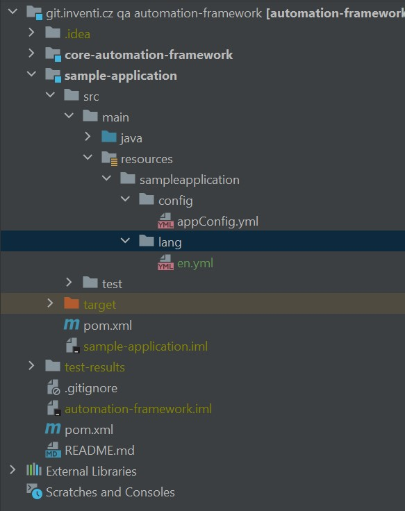

= Multi-language Support

The framework also supports testing of multi-language applications! In the following steps you will get to know how to set up the project for such use case.

. link:./multilanguage.adoc#_1_create_a_language_file_resources_folder[Create a Language File Resources Folder]
. link:./multilanguage.adoc#_2_create_a_dictionary_for_your_phrases[Create a Dictionary for Your Phrases]
. link:./multilanguage.adoc#_3_validate_phrases_in_the_code_using_keywords_and_index_file[Validate Phrases in the Code Using Keywords and Index File]
. link:./multilanguage.adoc#_4_specify_language_used_in_the_test[Specify Language Used in the Test]

== 1. Create a Language File Resources Folder

Navigate to your Maven project's module directory - typical path is `<your module name>/src/java/main/resources/<your application name>` and create a folder with name `lang`. Now you can supply dictionary files for any of the language you may need.

== 2. Create a Dictionary for Your Phrases

To be able to extend language support for the framework, we need to create a dictionary file that will contain all of the keywords (that will be used later in the code) and their corresponding phrases in given language.

Create a YAML file inside of the language file resources folder from the previous step, using following naming convention - the file's name should be an ISO 639-1 valid language identifier in lower-case format. For full list of supported identifiers, you can check `Language` class file. This Java enumeration contains all possible values in an upper-case format.

For example, to supply a dictionary file for English language, the filename would be following: `en.yml`. For Czech language, it would be either `cs_cz.yml` or `cs.yml`, and so on.

[link=../../img/dictionary-file-location.jpg]

Inside this created file we now define our dictionary in a YAML file structure. The structure should be following:

.File en.yaml
[source,yaml]
----
dictionary:
    HERE_DEFINE_YOUR_KEYWORD: "Keyword's phrase translation in given language"
    ANOTHER_KEYWORD: "Another translation"
----

The keywords should be defined in upper-case format as they will be later used as Java enumeration values.

For a real-world scenario, where you'd like to validate text of a "Continue" button in English and Czech, the dictionary files would look like following:

.File en.yaml
[source,yaml]
----
dictionary:
    BTN_CONTINUE: "Continue"
----

.File cs_cz.yaml
[source,yaml]
----
dictionary:
    BTN_CONTINUE: "Pokračovat"
----

== 3. Validate Phrases in the Code Using Keywords and Index File

Now we are almost ready to validate text against our dictionary defined values using given keywords directly in the Java code. To access our keywords defined in the dictionary file an easier way, we should "transfer" the keywords from dictionary file to the Java world. For this purpose we will create an "index" Java enumeration that will contain all the possible keywords. Then, using this enumeration value in the code, we can validate against the specific text in a correct dictionary.

Create a Java enumeration class anywhere in your project you find comfortable. For our example, let's call it `Index.class`. Now provide enumeration values that will represent our keywords defined in the dictionary file (i.e. `BTN_CONTINUE` from the previous step).

.Index.class example:
[source,java]
----
package cz.inventi.qa.framework.testapps.testweb.lang;

public enum Index {
        BTN_CONTINUE;
}

----

Now in the code of our test, we can validate text by te enumeration value using appropriate method accessible from the *LanguageManager* (static) object supplying the name of the keyword we want to verify and a valid application object:

[source,java]
----
LanguageManager.getTranslation(Index.BTN_CONTINUE, someApplicationObject);
----

.Test use-case:
[source,java]
----
    public class SomeStepsExample extends StepsBase {
        private final HomePage homePage = getWebAppInstanceOf(HomePage.class);
        
        @Step("Check Continue Btn Text")
        public SomeStepsExample checkContinueBtnText() {
            String continueBtnTextTranslated = LanguageManager.getTranslation(Index.BTN_CONTINUE, homePage);
            Assert.assertEquals(
                    homePage.getContinueBtn().getText(),
                    continueBtnTextTranslated,
                    "Check continue btn text is '" + continueBtnTextTranslated + "'"
            );
            return this;
        }
    }
----

Note that each of the applications has its own dictionary resources, therefore 

== 4. Specify Language Used in the Test

In order for the framework to be able to use the right dictionary file, you need to supply a `language` parameter on the input. This can be done either via command line or TestNG suite. Again, the value of this parameter should correspond to the ISO 639-1 format in lower-case.

.Example for command line:
[source,]
----
... -Dlanguage=en ...
----

.Example for TestNG suite:
[source,xml]
----
...
    <parameter name="language" value="en"/>
...
----

If not `language` parameter is specified, the framework does not load any of the dictionary files.