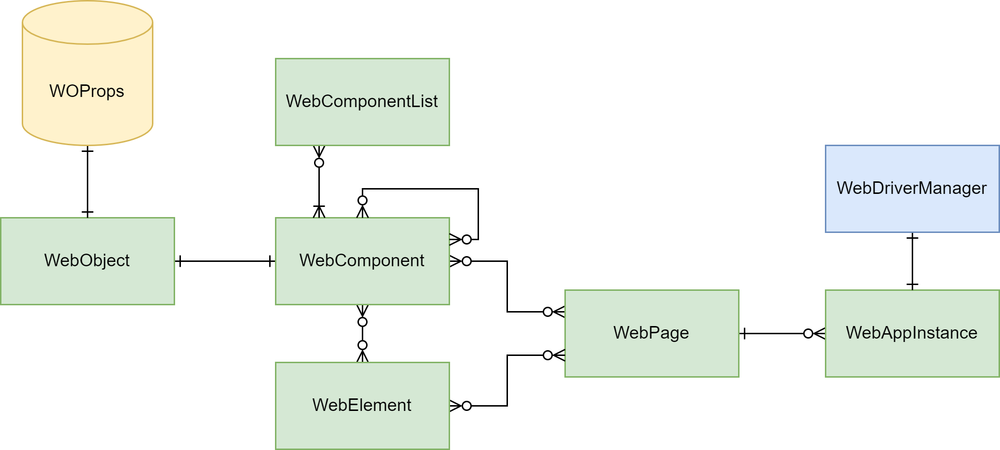

= Web Component Structure

[link=../../img/web-objects-structure.drawio.png]

== Description of Components

- link:./web/webobject-structure.adoc[WebObject]
- link:./web/webcomponent-structure.adoc[WebComponent]
- link:./web/webcomponentlist-structure.adoc[WebComponentList]
- link:./web/webelement-structure.adoc[WebElement]
- link:./web/webpage-structure.adoc[WebPage]